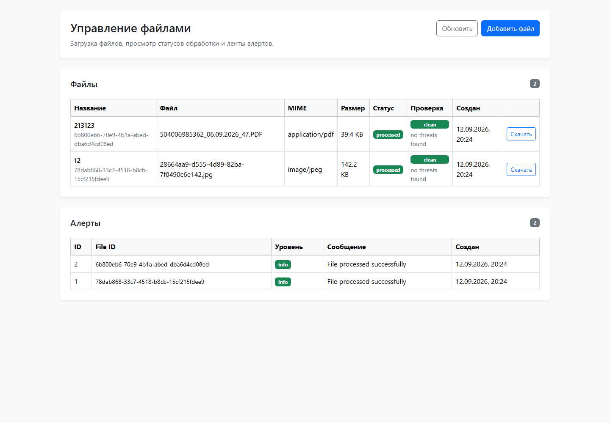

# Fullstack test task — файловый обменник

[](https://github.com/toshnotik/fullstack-test-task-sputnik/actions/workflows/ci.yml)

MVP файлового обменника: загрузка файлов, проверка подозрительного содержимого, извлечение базовых метаданных и создание алертов.

## Интерфейс



## Запуск локально

Собрать и запустить локальный стек:

```bash
docker compose -f docker-compose.dev.yml up --build
```

Применить миграции базы данных:

```bash
docker exec -it backend alembic upgrade head
```

Открыть:

- Frontend: http://localhost:3000/test
- Backend API docs: http://localhost:8000/docs

Frontend image собирается с `NEXT_PUBLIC_BACKEND_URL=http://localhost:8000` для браузера. Здесь намеренно используется `localhost`, а не имя Docker service, потому что этот URL использует браузер.

## Архитектура

Backend использует простую слоистую структуру, а не полноценную реализацию Clean Architecture.

```text
HTTP API
  -> services
    -> repositories
      -> SQLAlchemy / PostgreSQL

services
  -> storage
    -> local filesystem

Celery tasks
  -> processing service
```

- `api/`: FastAPI routers, работа с запросами/ответами и преобразование ошибок в HTTP.
- `services/`: сценарии приложения и границы транзакций.
- `repositories/`: SQLAlchemy queries и операции сохранения данных.
- `storage/`: операции с локальными файлами: path, save, read, exists и delete.
- `core/`: общая конфигурация и SQLAlchemy engine/sessionmaker.
- `tasks.py`: тонкая Celery orchestration вокруг функций сервиса обработки.

Структура frontend:

```text
page.tsx
  -> api layer
    -> backend

page.tsx
  -> presentational components
```

`page.tsx` всё ещё владеет состоянием страницы и orchestration. API calls находятся в `src/api`, backend DTO types — в `src/types/api.ts`, а UI-блоки вынесены в presentational components, которые не делают HTTP calls. Включён strict TypeScript.

## Основные исправления

### Консистентность удаления

Изначально физический файл удалялся до удаления записи из базы данных. Если `Alert` всё ещё ссылался на `StoredFile`, удаление из базы данных могло упасть на foreign key уже после удаления файла с диска.

Текущая последовательность удаления:

1. Удалить alerts для файла.
2. Удалить строку файла.
3. Закоммитить транзакцию базы данных.
4. Удалить физический файл.

База данных остаётся source of truth. Если удаление из filesystem падает после успешного commit в базе данных, база данных остаётся консистентной, а физический файл может остаться на диске для последующей очистки.

### Консистентность загрузки

Если upload успел сохранить физический файл, но insert/commit в базе данных упал до успешного завершения, сохранённый файл очищается, а исходное исключение не скрывается.

### Оптимизация памяти upload и event loop

Это основная бонусная оптимизация.

Предыдущий upload path читал весь файл в память и записывал его синхронно:

```python
await upload_file.read()
Path.write_bytes(...)
```

Текущее поведение:

- upload читается по chunk;
- размер chunk по умолчанию — 1 MiB;
- размер файла считается во время streaming;
- блокирующие записи на диск вынесены через `asyncio.to_thread`;
- partial files удаляются при ошибке записи.

Так потребление памяти в upload path не растёт вместе с полным размером файла. Бенчмарки не заявляются.

### Фоновая обработка

Celery tasks теперь являются тонкими orchestration functions. Scan, metadata extraction и alert creation находятся в `services/processing.py`. Переиспользуемого global event loop больше нет; каждая task использует `asyncio.run(...)`, а SQLAlchemy async engine после этого dispose-ится, чтобы pooled async connections не переходили между event loops.

### Frontend

- включён strict TypeScript;
- API layer вынесен из `page.tsx`;
- UI разбит на `FilesTable`, `AlertsTable` и `UploadFileModal`;
- улучшены состояния loading, refresh, empty, error и submit;
- сделан практичный accessibility pass;
- добавлены тесты на Jest + React Testing Library.

### Воспроизводимый Docker

- убрана зависимость frontend Docker build от отсутствующего `.env.production`;
- frontend build получает `NEXT_PUBLIC_BACKEND_URL` через Docker build arg;
- имя Redis env приведено к `REDIS_URL`;
- Docker Compose build был проверен локально.

## Проверки качества

Backend:

```bash
cd backend
uv sync --extra dev --frozen
uv run --extra dev pytest tests
uv run --extra dev ruff check src tests
uv run --extra dev ruff format --check src tests
uv run --extra dev mypy src tests
```

Frontend:

```bash
cd frontend
npm ci
npm test -- --runInBand
npx tsc --noEmit
npm run build
```

Текущее проверенное количество тестов:

- backend: 22 pytest tests;
- frontend: 13 Jest/RTL tests.

GitHub Actions запускает backend и frontend jobs независимо на `push` и `pull_request`.

## Технические решения и компромиссы

- Local filesystem storage оставлен, потому что это MVP test task. В production deployment, скорее всего, стоило бы использовать object storage.
- Операции базы данных и filesystem нельзя сделать по-настоящему atomic без дополнительного механизма.
- Celery processing steps сохраняют отдельные транзакции базы данных, что соответствует границам tasks и оставляет workflow простым.
- Processing всё ещё делает local file reads для metadata extraction; оптимизированы только upload writes, чтобы они не блокировали request event loop.
- React Query, Redux, Context и feature-folder architecture не добавлялись, потому что состояния внутри `page.tsx` достаточно для этого scope.
- Deployment и production orchestration не добавлялись, кроме локального Docker Compose и CI checks.

## Структура проекта

```text
backend/src/
  api/
  core/
  repositories/
  services/
  storage/
  app.py
  tasks.py

frontend/src/
  api/
  app/
  components/
  types/

.github/workflows/ci.yml
docker-compose.dev.yml
```

## Тесты

Backend tests покрывают:

- поведение file API: upload/list/get/update/delete/download;
- случаи 404;
- консистентность удаления файлов, на которые ссылаются alerts;
- поведение streaming upload и пути очистки;
- пути processing clean/suspicious/failed;
- поведение alerts listing и alert creation.

Frontend tests покрывают:

- таблицы files и alerts;
- loading и empty states;
- взаимодействия upload modal и submitting state;
- initial load страницы, refresh после успешного upload и отображение API error.

## Ограничения

Проект остаётся MVP. В нём намеренно нет object storage, distributed transactions, сложного frontend state management, deployment pipelines и coverage thresholds. Цель — читаемый refactor с tests, CI и воспроизводимым локальным запуском, а не production-система.
